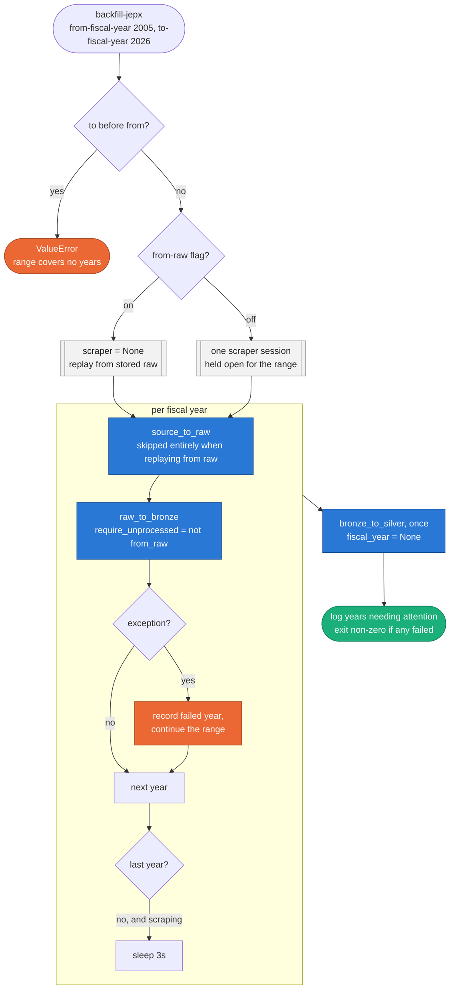

# JEPX Spot Price Pipeline — High-Level Design

`src/orchestration/pl_jepx_spot_price.py` — the ADF-like orchestrator for JEPX
spot prices. Two entry points share one set of step functions:

| CLI command | Function | Purpose |
|---|---|---|
| `run-jepx-orchestrator` | `run_jepx_orchestrated_pipeline()` | One forward-moving run: today's snapshot through to silver |
| `backfill-jepx` | `run_jepx_backfill_pipeline()` | A range of fiscal years, replayed |

Every step returns a `PipelineStepResult` carrying `name`, `status`
(`success` / `skipped` / `failed`) and a `detail` string. The command's exit
code is derived from the list, not from whether the process reached the end.

---

## 1. Orchestrated run (`run-jepx-orchestrator`)

```mermaid
flowchart TD
START(["run-jepx-orchestrator"]) --> SCRAPE
SCRAPE["1. source_to_raw<br/>JEPXSpotSummaryScraper<br/>POST spot_summary_FY.csv"]
SCRAPE --> CHANGED{"snapshot changed?"}
CHANGED -->|"sha256 matches<br/>stored snapshot"| RAWSKIP(["skipped"])
CHANGED -->|"new bytes"| RAWOK["write raw object<br/>plus metadata catalog entry"]
RAWSKIP --> FY[["snapshot_fiscal_year"]]
RAWOK --> FY
FY --> BRONZE["2. raw_to_bronze<br/>ingest_jepx_spot_summary<br/>cp932 decode, Polars cast, Iceberg append"]
BRONZE --> DEDUP{"ingestion log:<br/>unprocessed snapshot?"}
DEDUP -->|"no, ValueError"| BRSKIP(["skipped"])
DEDUP -->|"yes"| BROK(["success, rows=N"])
BRSKIP --> SCOPE
BROK --> SCOPE
SCOPE{"resolve_silver_fiscal_year"}
SCOPE -->|"silver-all-fiscal-years"| SCOPEALL[["None, every year"]]
SCOPE -->|"silver-fiscal-year N"| SCOPEN[["N"]]
SCOPE -->|"default"| SCOPEDEF[["snapshot_fiscal_year"]]
SCOPEALL --> SILVER
SCOPEN --> SILVER
SCOPEDEF --> SILVER
SILVER["3. bronze_to_silver<br/>DuckDB scan, cast, dedupe<br/>PyIceberg window replace"]
SILVER --> TABLES[/"silver.jepx_spot_price_base<br/>silver.jepx_spot_price_block<br/>silver.jepx_spot_price_area"/]
TABLES --> VERIFY{"verify_silver_row_counts<br/>staged / valid / actual"}
VERIFY -->|"nothing staged,<br/>all rows dropped,<br/>or count mismatch"| SFAIL(["failed"])
VERIFY -->|"counts agree"| SOK(["success"])
SFAIL --> GOLD
SOK --> GOLD
GOLD{"run-gold-step flag?"}
GOLD -->|"off, the default"| GSKIP(["skipped"])
GOLD -->|"on"| DBT["4. silver_to_gold<br/>subprocess: uv run dbt run<br/>select tag:gold"]
GSKIP --> DONE
DBT --> DONE
DONE(["list of PipelineStepResult<br/>exit non-zero if any step failed"])
classDef step fill:#2a78d6,stroke:#1a4d8f,color:#ffffff
classDef ok fill:#1baf7a,stroke:#12805a,color:#ffffff
classDef skip fill:#8a8a8a,stroke:#5c5c5c,color:#ffffff
classDef bad fill:#eb6834,stroke:#a8461f,color:#ffffff
classDef data fill:#f2f2f2,stroke:#999999,color:#222222
class SCRAPE,BRONZE,SILVER,DBT step
class RAWOK,BROK,SOK,DONE ok
class RAWSKIP,BRSKIP,GSKIP skip
class SFAIL bad
class FY,SCOPEALL,SCOPEN,SCOPEDEF,TABLES data
```



### What the diagram is saying

**`skipped` is a normal outcome, not a degraded one.** JEPX republishes the
same fiscal-year file continuously, so a run that finds an unchanged sha256, or
a bronze ingestion that finds nothing unprocessed in the ingestion log, has
correctly done nothing. Both still return a step result and both let the run
continue — silver may still have work to do.

**The fiscal year threads through.** `source_to_raw` returns the year its
snapshot covered, and that value feeds both bronze ingestion and the default
silver scope. This is why the step returns a tuple rather than just a result.

**Silver scope defaults to one year on purpose.** Rebuilding every year on
every run makes the cost grow with accumulated history rather than with new
data. `--silver-all-fiscal-years` is the explicit opt-in; see
`resolve_silver_fiscal_year()`.

**Silver is verified by row count, not by completion.** Three failure shapes
look identical from outside — nothing staged, everything dropped in validation,
or a count mismatch between the staging relation and the table. Without the
check, a run whose `delivery_date` column stopped parsing reported
`dropped=0, written=0, status=success` while silver went unwritten. That is the
shape both JEPX backfill incidents took.

---

## 2. Backfill (`backfill-jepx`)



### What the diagram is saying

**Silver runs once, at the end.** A scoped silver run re-scans the whole bronze
table anyway — the fiscal-year filter applies to a cast column, so it cannot be
pushed into the Iceberg scan — and one unscoped pass covers every year for the
cost of a single scan. Running it per year would multiply that scan by 22.

**A failing year does not stop the range.** The year is recorded and the loop
continues; the command exits non-zero afterwards and names the years needing
attention. A replay that tells you all four broken years beats one that stops
at the first.

**`--from-raw` flips the dedup filter.** With a scraper, `require_unprocessed`
is on and the run only takes snapshots the ingestion log has not fed to bronze.
A replay reruns snapshots already marked processed, so leaving the filter on
would resolve nothing for every year and silently do no work at all.

**The 3-second delay only exists while scraping.** Nothing else paces the
requests — the scraper holds no delay or retry of its own, and the range is one
request per fiscal year back to back.

---

## 3. Note: the orchestrator's gold step is not the gold layer

`--run-gold-step` shells out to `dbt run --select tag:gold`, and
`src/dbt/jepx_power/` currently has **no models**. The flag defaults to off and
the step reports `skipped`.

The gold layer that actually exists is built by a separate command:

```bash
uv run python src/main.py ingest-jepx-silver-to-gold
```

which runs `src/pipeline/gold/silver_to_gold_jepx_spot_price.py`
(DuckDB aggregate + PyIceberg window replace) and produces
`gold.jepx_spot_price_daily`, `_period_profile` and `_area_spread`.

The dbt step predates that decision and is kept for when dbt models arrive.
Treat the orchestrator as a **raw → bronze → silver** pipeline today.

---

## Related documents

- `docs/architecture/pipeline_flow.md` — stage contracts, source-agnostic
- `docs/architecture/replay_strategy.md` — the rebuild procedure `backfill-jepx` implements
- `docs/architecture/orchestration_strategy.md` — why CLI orchestration over notebooks
- `docs/tasks/tasks.md` §8.4 — the row-count verification incident
